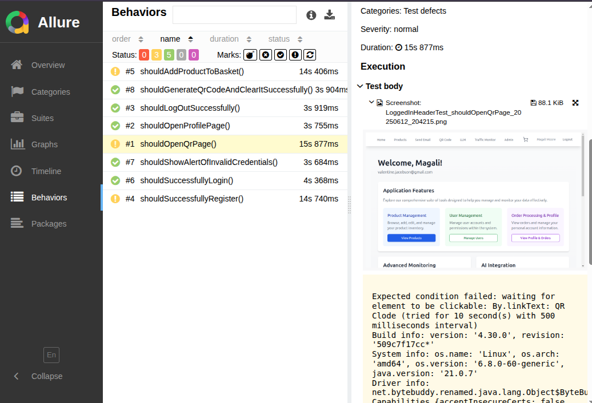

# ShopApp End-to-End Testing Suite

This repository contains an automated **end-to-end test suite** for the full-stack web application **ShopApp**, written in **Java 21** using **Selenium WebDriver**, **JUnit 5**, and **Allure Reports**. It integrates **backend API testing via OkHttp** and performs **cross-browser testing** via **Selenium Grid**.

These tests ensure that key user flows work correctly and that the frontend and backend remain consistent.

---

## ✅ Key Features

- 🔐 **Authentication** tests: login, logout, registration, error handling
- 🛒 **Shopping flow**: add to cart, product listing, checkout process
- 🔁 **Frontend-Backend verification**: using OkHttp to validate API responses against frontend UI states
- 🧪 **End-to-End user simulation**: real user journeys from registration to profile and QR code access
- 📷 **Automatic screenshots** on test failure
- 🌐 **Cross-browser testing**: Chrome, Edge and Firefox via Selenium Grid in Docker
- 📊 **Allure Reports**: rich test reporting with step-by-step logs
- 🔀 **Randomized test data** generation using [DataFaker](https://github.com/datafaker-net/datafaker)
- 🔎 **Detailed logs** using SLF4J + Logback

---

## 🚀 Technologies Used

| Tool / Library        | Purpose                                      |
|-----------------------|----------------------------------------------|
| Selenium WebDriver    | UI browser automation                        |
| OkHttp                | Backend API testing & HTTP interception      |
| JUnit 5               | Test framework                               |
| Allure                | Test report generation                       |
| DataFaker             | Randomized user data generation              |
| Docker Compose        | Launching Selenium Grid                      |
| Chrome/ Firefox / Edge| Cross-browser execution                      |
| SLF4J + Logback       | Logging with test context                    |
| AssertJ               | Fluent assertions                            |
| Lombok                | Boilerplate reduction in DTOs and models     |
| Jackson Databind      | JSON parsing for backend communication       |

---

## 🧪 Example Highlight: Backend-Frontend Consistency Test

One of the most interesting tests checks whether the login via UI matches the backend's behavior. The test:

1. **Generates a test user** with random credentials using DataFaker.
2. **Sends a login request via OkHttp** to `/users/signin` and captures the token.
3. **Performs login via the frontend (Selenium)**.
4. **Compares UI elements (e.g. displayed username, roles)** with the backend JSON response.

```java
OkHttpClient client = new OkHttpClient();
RequestBody body = RequestBody.create(jsonPayload, MediaType.parse("application/json"));
Request request = new Request.Builder().url(BASE_URL + "/users/signin").post(body).build();
Response response = client.newCall(request).execute();
String responseBody = response.body().string();
// Then we parse JSON and assert frontend vs backend consistency
```

On UI failure, the test **automatically captures a screenshot** and attaches it to the Allure report.

---

## 📂 Project Structure

```
shopapp-selenium/
├── src/
│   ├── main/
│   │   └── java/pl/goral/
│   └── test/
│       └── java/pl/goral/
├── docker-compose.yml       # Selenium Grid config
├── pom.xml                  # Maven dependencies
└── Jenkinsfile              # Jenkinsfile config
└── ci.yml                   # git ci process
└── README.md

```

---

## 🧰 Running the Tests

### Prerequisites

- Java 21
- Maven
- Docker & Docker Compose

### 1. Start Selenium Grid

```bash
docker-compose up -d
```

### 2. Run Tests

```bash
mvn clean test
```

### 3. Run Specific Test (e.g. RegisterTest)

```bash
mvn test -Dtest=RegisterTest
```

You can also override test properties:

```bash
mvn test -Dcredentials.username=admin -Dcredentials.password=admin
```

---

## 📊 Allure Reporting

```bash
# Run tests
mvn clean test

# Generate report
allure generate allure-results -o target/allure-report

# Open report in browser
allure open target/allure-report
```

examples


---

## 📸 Screenshots on Failure

Every time a test fails, a screenshot of the current browser state is captured and included in the Allure report. This helps to visually debug UI issues.

---

## 🔧 Cross-Browser Testing

Tests are executed in both **Chrome** and **Firefox** through **Selenium Grid**. You can customize browser settings in the `docker-compose.yml` or within the test configuration classes.

---

## 👤 Dynamic Test Users

All test users are created on the fly using [DataFaker](https://github.com/datafaker-net/datafaker):

```java
RegisterRequestDto user = new RegisterRequestDto(
    faker.name().username(),
    faker.internet().password(),
    faker.internet().emailAddress(),
    faker.name().firstName(),
    faker.name().lastName(),
    List.of("ROLE_ADMIN", "ROLE_CLIENT")
);
```
```java

@BeforeEach
public void setUp() {
driver.navigate().to(ConfigProvider.get("frontend.url") + "/products");
}

    @Test
    public void shouldAddProductToBasket() {
        // given
        ProductsPage productsPage = new ProductsPage(driver);

        // when
        int productIndex = productsPage
                .verifyIsLoaded()
                .addRandomProductToBasketAndReturnItsIndex();

        // then
        String productName = productsPage.getProductName(productIndex);
        productsPage.verifyProductCartUpdated(productIndex);
        productsPage.getToast().verifyMessage("Added to cart", String.format("1 × %s added to your cart", productName));
        productsPage.getLoggedInHeader().assertProductCountInBasket(1);

        assertThat(GetCartApi.getCurrentNumberOfItemsInCart(token)).isEqualTo(1);
    }
```

This ensures uniqueness and helps avoid duplicate user errors in tests.

---

## 🧠 Sample Test Log Output

```
INFO  RegisterTest#shouldSuccessfullyRegister
INFO  Using Chrome
INFO  Using user: sudie.treutel / gary.macejkovic@gmail.com
INFO  Navigated to /register
INFO  Inserted username, email, password...
INFO  Finished test RegisterTest#shouldSuccessfullyRegister
```

Logs also capture **API requests/responses via OkHttp**:

```

20:42:18.680 [ForkJoinPool-1-worker-1] INFO  p.g.listeners.TestExecutionListener -- Navigated to http://localhost:8081
20:42:18.823 [ForkJoinPool-1-worker-1] INFO  p.g.listeners.TestExecutionListener -- Navigated to http://localhost:8081
20:42:19.490 [ForkJoinPool-1-worker-1] INFO  p.g.extensions.NameLoggingExtension -- Finished test LoggedInHeaderTest#shouldOpenProfilePage
20:42:19.499 [ForkJoinPool-1-worker-1] INFO  p.g.extensions.NameLoggingExtension -- Starting test LoggedInHeaderTest#shouldLogOutSuccessfully
20:42:19.499 [ForkJoinPool-1-worker-1] INFO  pl.goral.SeleniumTest -- Using Chrome
20:42:20.453 [ForkJoinPool-1-worker-1] INFO  pl.goral.generators.UserGenerator -- Using user with details RegisterRequestDto(username=candra.bechtelar, password=itl72l5i33ho3fgy, email=thanh.sipes@gmail.com, firstName=Sanford, lastName=Brakus, roles=[ROLE_ADMIN, ROLE_CLIENT]) in test
20:42:21.269 [ForkJoinPool-1-worker-1] INFO  p.g.h.i.OkHttpLoggingInterceptor -- 
===== OKHTTP REQUEST =====
Request: POST http://localhost:4001/users/signin
Request JSON body:
{
  "username" : "candra.bechtelar",
  "password" : "itl72l5i33ho3fgy"
}

===== OKHTTP RESPONSE =====
Response: 200  for http://localhost:4001/users/signin
Response headers:
  Cache-Control: no-cache, no-store, max-age=0, must-revalidate
  Connection: keep-alive
  Content-Type: application/json;charset=UTF-8
  Date: Thu, 12 Jun 2025 18:42:21 GMT
  Expires: 0
  Keep-Alive: timeout=60
  Pragma: no-cache
  Transfer-Encoding: chunked
  Vary: Access-Control-Request-Headers
  X-Content-Type-Options: nosniff
  X-Frame-Options: DENY
  X-XSS-Protection: 0
Response JSON body:
{

```

---

## 🤝 Contributing

Feel free to fork, open issues, or submit pull requests. Suggestions for improvements are always welcome!

---

## 📃 License

This project is open source and licensed under the MIT License.
